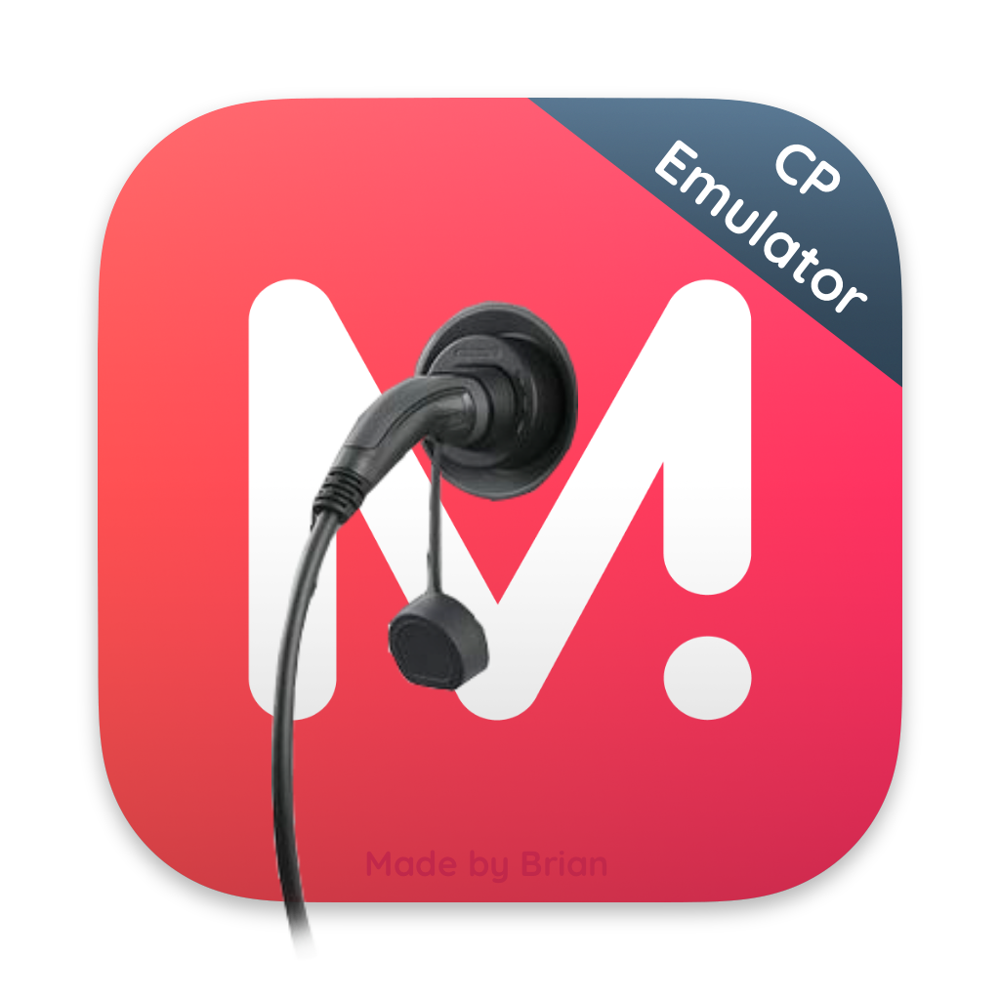

<p align="center">
  
</p>


# OCPP Charge Point Emulator

Emulate OCPP charge points over OCPP-J (WebSocket) for CSMS testing. Supports **OCPP 1.6**, **2.0.1**, and **2.1**.

### OCPP 1.6

- Core (Done)
- Firmware Management (Done)
- Local Auth List Management (Done)
- Reservation (Done)
- Smart Charging (Done)
- Remote Trigger (Done)
- Security Whitepaper (Done)

### OCPP 2.0.1

Full charge-point client via `library-ocpp` `ocpp-v201`: provisioning, availability, remote control, transactions (`TransactionEvent`), authorization, local list, smart charging, reservation, firmware, certificates, diagnostics, display messages, tariff/cost, data transfer.

### OCPP 2.1

In-repo protocol under `ocpp/v21/protocol/` (Part 3 schemas) plus handlers for shared 2.0.1 actions and 2.1-only blocks (tariffs, DER, periodic event streams, priority charging, dynamic schedule, battery swap, settlement, AFRR).

### How to run

IntelliJ run configs in `.run/`, or:

```shell
./gradlew :app:run
```

Create a charge point and select **OCPP-1.6**, **OCPP-2.0.1**, or **OCPP-2.1** in the form. Connect uses subprotocol `ocpp1.6` / `ocpp2.0.1` / `ocpp2.1`.

## Message interception

The 🤓 icon opens message interception for per-action request/response mutation. Interception does not drive domain state by itself (e.g. forging `RequestStopTransaction` will not stop an active charge).

## Executables

Latest builds: [releases](https://github.com/monta-app/ocpp-emulator/releases) (Windows, Linux, macOS).

## MacOS

After installing the `.dmg`, run `xattr -d com.apple.quarantine /Applications/OcppEmulator.app` if Gatekeeper blocks launch.

## How to contribute

- Follow the [Code of Conduct](CODE_OF_CONDUCT.md)
- Test your changes (`./gradlew :app:jvmTest` / `ktlintCheck`)
- Update docs when behavior or layout changes
